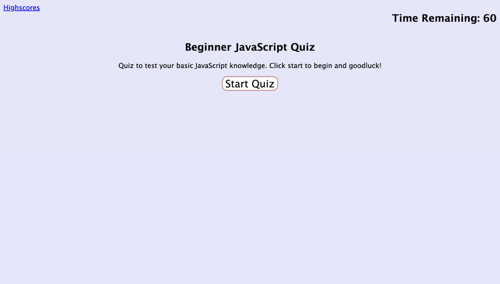
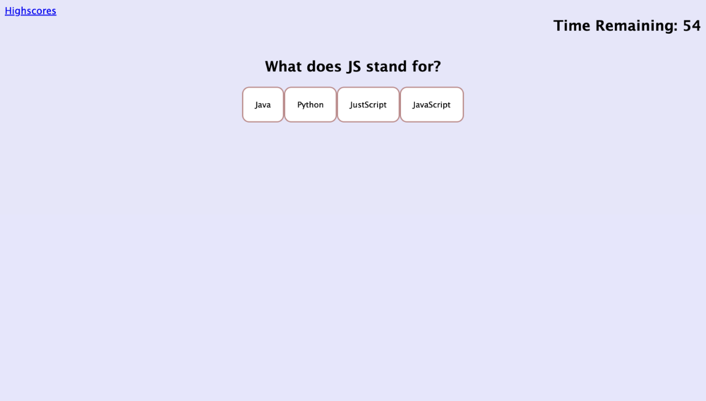
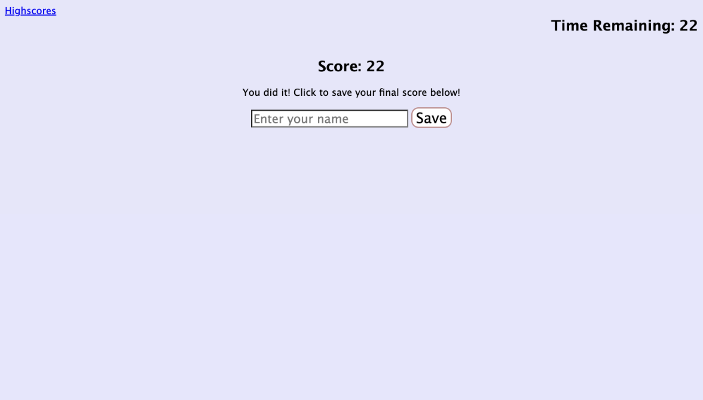

# Basic-Coding-Quiz
## Description

In this project we created a quiz to test basic Javascript knowledge and used JS to allow the user to answer multiple choice questions and receive feedback on their answer within the browser. The quiz is timed and 10 seconds are deducted when a question is answered incorrectly. At the end of the quiz users can enter their names and save their scores, which can then be viewed on the 'Highscores' page.

## Repository

Link to deployed code:  <https://github.com/shannontice/Basic-Coding-Quiz>

## Technologies

 - This is written with HTML5 and CSS 
 - HTML follows semantic structure for SEO
 - Refactor CSS for faster loading and efficiency
 - JavaScript was utilized to allow user to interact with the browser and select the answer choices for the quiz
 - JS was also used to provide feedback on the given answer and monitor the time 
 - Local Storage was utilized to log user score information and create a Highcores Page.

## Mock-Up

The following image shows the web application's appearance and functionality:

